# Measurement of speed and displacement using an accelerometer and gyroscope - IMU
> The device was created to measure training parameters in powerlifting.

## Table of contents
* [General info](#general)
* [Microcontroler (Arduino) and peripherals](#arduino)
  + [Components](#components)
  + [Calibration of sensors](#calibration)
  + [Libraries](#libraries)
  + [Connecting](#connecting)
  + [Arduino application](#aprogram)
* [Measurement of speed and displacement](#measurement)
 + [Madgwick's filter](#madgwick)
 + [Compensation of gravitational acceleration](#compensation)
 + [Zero Velocity Update (ZVU)](#zvu)
 + [Obtaining speed of device](#ospeed)
 + [Obtaining displacements of device](#odisplacements)
 + [Block diagram](#block)
* [Android program](#androidp)
* [Device case](#case)
* [Testing](#testing)
* [Contact](#contact)


<a name="general"></a>
## General info
The device was created while writing the master's thesis, thus all documentation are written in Polish.

Arduino microcontroller was used to build the device. Special attention was given to use of a cheap inertial sensors (they were bought on AliExpress for a few dollars). Velocity and displacements are measured on the basis of accelerations obtained thanks to the accelerometer. Both - gyroscope and accelerometer - combined with a Madgwick's filter and ZVU filtering are used to reduce drift, which are characteristic error of the MEMS sensors. In addition, it occurs when integrating the acceleration.

Additionaly phone application has been created to operate the device and read the measurement results. It allows the phone to connect to the device via bluetooth. After collecting measurement data, all calculations are performed in it. Data is saved in a local SQL database. The application allows you to see all the records in the form of plots.

At the end all components were soldered on a breadboard and a device case was designed and printed. The case allows you to mount the device on an Olympic barbell.

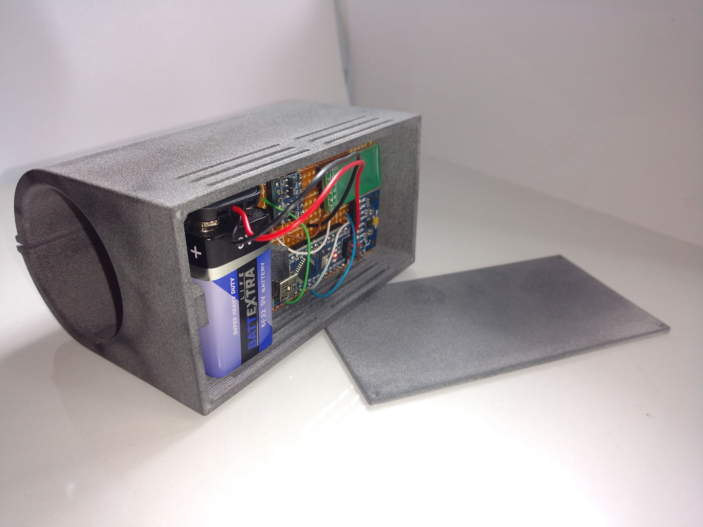

<a name="arduino"></a>
## Microcontroler (Arduino) and peripherals

In this section I have described all components I have used to build the device. I have also shown how to put all things together.

<a name="components"></a>
### Components
* Arduino Nano
* MPU-92/65 (almost the same as 9250)
* Bluetooth module SPP-C (replacement for HC-05)

<a name="calibration"></a>
### Calibration of sensors
Due to the lack of devices used to sensors calibration, the method described in [this work](https://www.researchgate.net/publication/273383944_A_robust_and_easy_to_implement_method_for_IMU_calibration_without_external_equipments) was used.

<a name="libraries"></a>
### Libraries
In order to use my program you need to download and include [MPU9250 library](https://github.com/Wojtek120/MPU9250). Link directs to my fork, if you decide to download lib from [author](https://github.com/bolderflight) you need to change lines in .h file:
```c
const int16_t tX[3] = {0,  1,  0};
const int16_t tY[3] = {1,  0,  0};
```
to
```c
const int16_t tX[3] = {1,  0,  0};
const int16_t tY[3] = {0,  1,  0};
```

You should also enter acceleration of gravity appropriate to the place where you are.

<a name="connecting"></a>
### Connecting
First of all you need to connect all pieces together just like on the picture below if you are using program from my GitHub. The Bluetooth module goes through voltage level translator, because the module works on 3.3V and Arduino on 5V. If you don't have one and don't want to buy it you can also make voltage divider so not to damage the module.

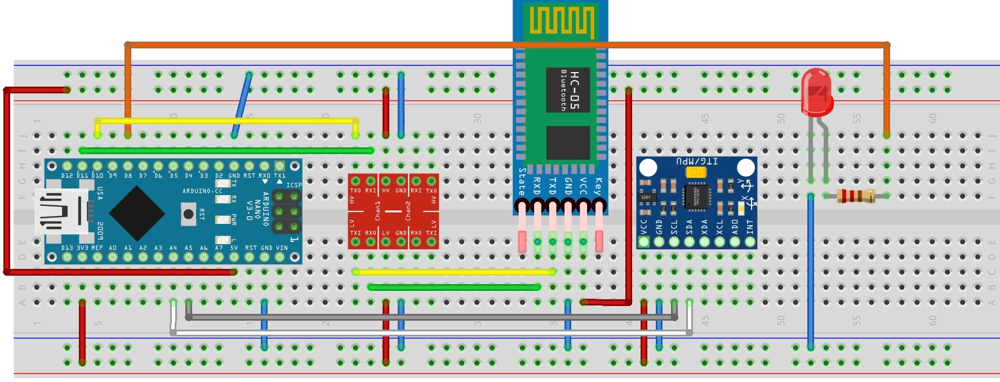

Giving a result as below.

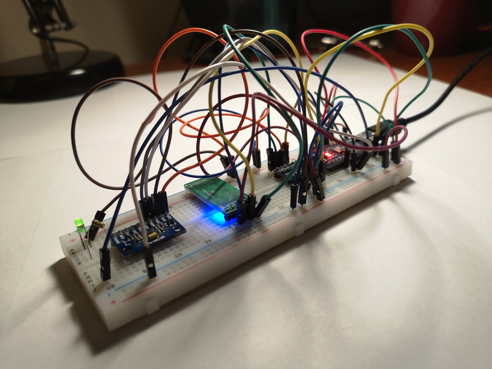

After tests I decided to solder it on solderable breadboard.

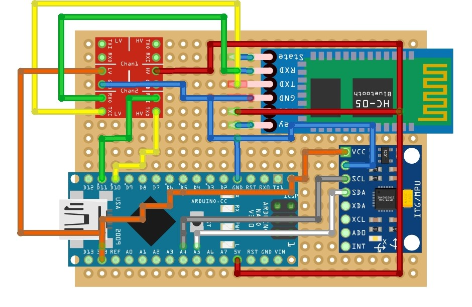

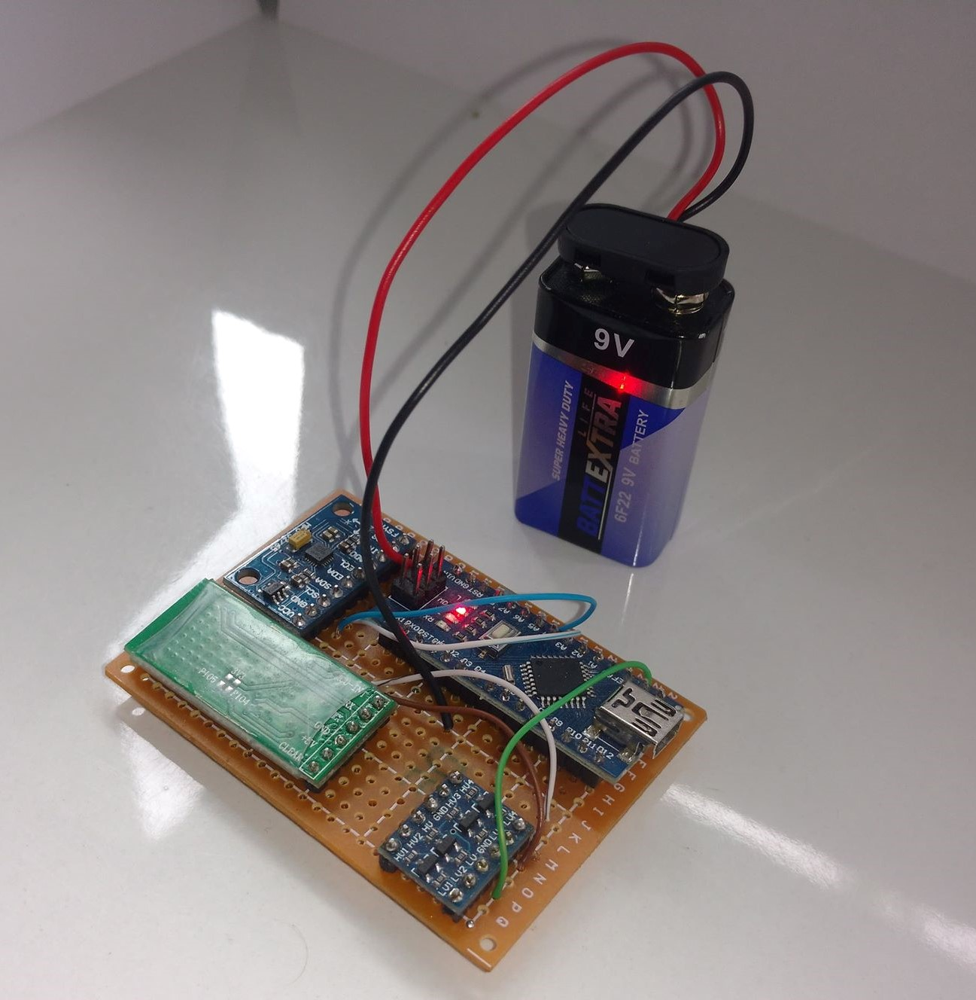

<a name="aprogram"></a>
### Arduino program
Microcontroller during startup initiates software UART communication with a transmission speed of 115200 bit/s on pins 10 and 11, up to which a bluetooth module is connected. Then a connection with MPU is established. The accelerometer scale is set to ±2G, the gyroscope to ±250 deg/s. The internal low-pass filter with a 5Hz band is activated, and then offsets and scale factors values, obtained by calibration, ​​are set. In the main loop the measurement values and current working time are cyclically read. This data are sent by the bluetooth module to mobile phone.

<a name="measurement"></a>
## Measurement of speed and displacement
Several steps must be completed so to get actual speed and displacement of device. All of them are described in this chapter.

<a name="madgwick"></a>
### Madgwick's filter
First of all it is necessary to get orientation of device in order to compensate acceleration of gravity from measurements. There are three most popular ways to do this: Kalman Filter, complementary filter and Madgwick filter. Research indicates that last method has three basic advantages: low computational cost, high performance (even at low sampling frequency) and is easy to tune. The report ["An efficient orientation filter for inertial and inertial/magnetic sensor arrays"](https://www.samba.org/tridge/UAV/madgwick_internal_report.pdf) published by Sebastian Madgwick in 2010 presents the theory and implementation of the proposed filter for IMU and MARG.

<a name="compensation"></a>
### Compensation of gravitational acceleration
With each measurement, the gravitational acceleration vector is first rotated to the device coordinate system, which is obtained after the filtration described above. The components of gravitational acceleration are then subtracted from the measurements provided by the sensor, thus obtaining information about the acceleration with which the device moved.

Pictures above show plots of acceleration without compensation

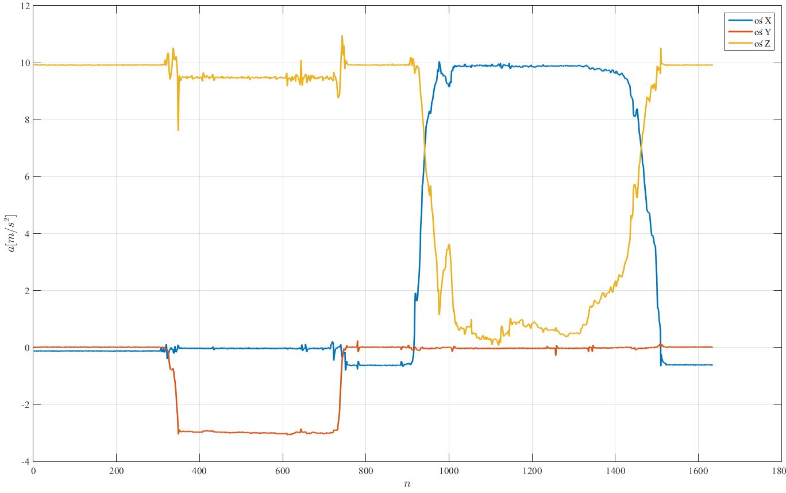

and with compensation.

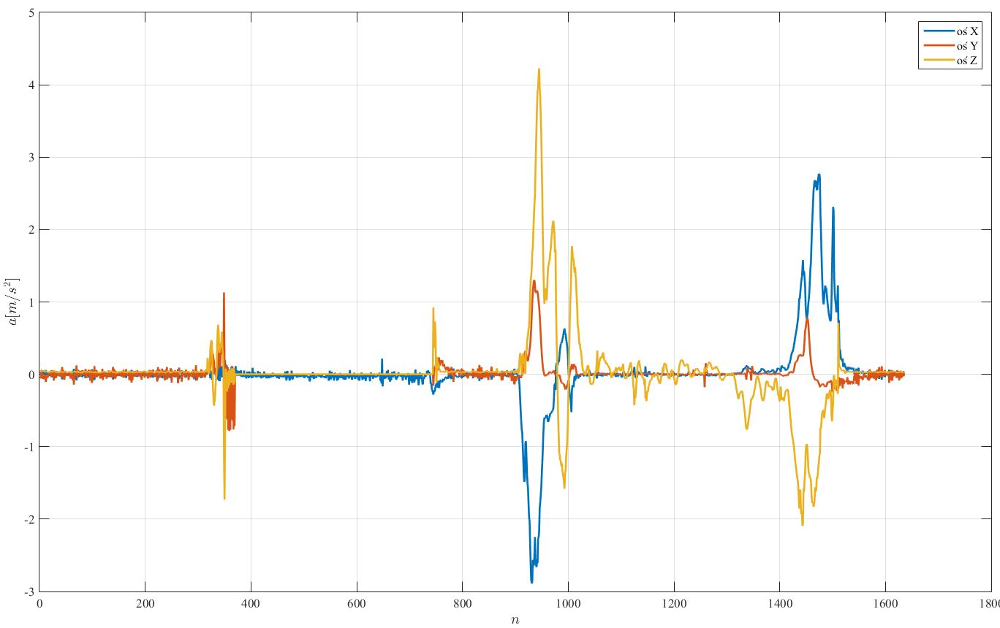

<a name="zvu"></a>
### Zero Velocity Update (ZVU)
The algorithm is used to recognize the moments in which the device was stationary. The algorithm checks if the acceleration and angular velocities do not exceed the threshold values in a given number of samples. When one of the measurements exceeds the threshold value, the algorithm returns information about the movement of the device. The threshold values and the number of samples were selected experimentally.  

Picture bellow presents accelerations plots with marked stationary states (black plot -> if 1 than true).

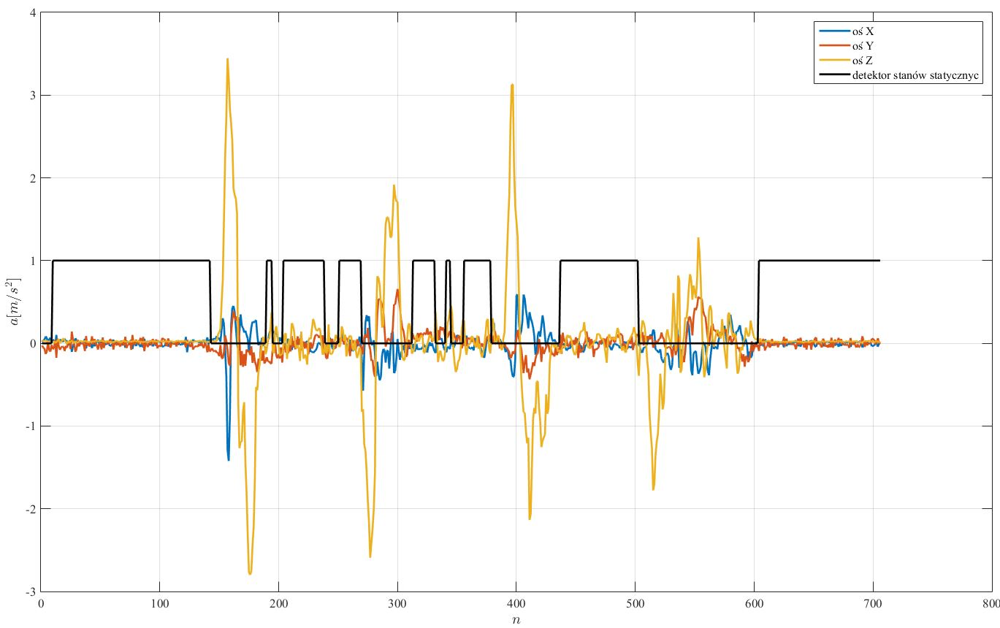

<a name="ospeed"></a>
### Obtaining speed of device
The data acquisition time is acquired in the microcontroller and it is saved on the phone along with the measurement values. Based on these values, it is possible to calculate the integral of the accelerations in each axis to obtain speed. Drift can be observed on the graph of velocity after integration. Example is shown bellow.

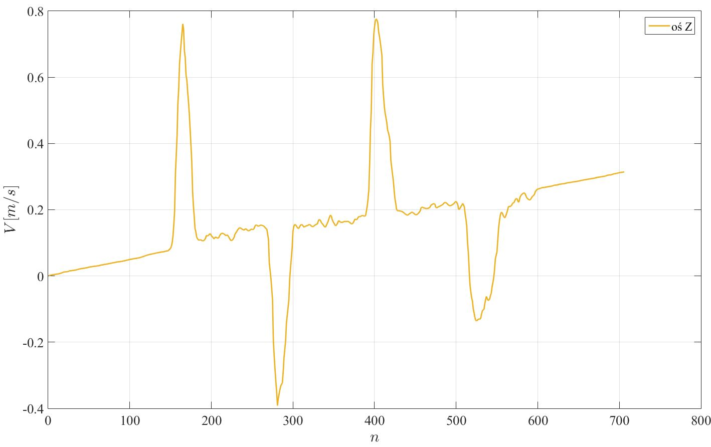

Knowing, thanks to the ZVU algorithm, at which moments the device starts and ends the movement, we can estimate how fast drift increases and subtract its value from the value of the speed determined by integration, while when the device is not moving bring the speed to zero.

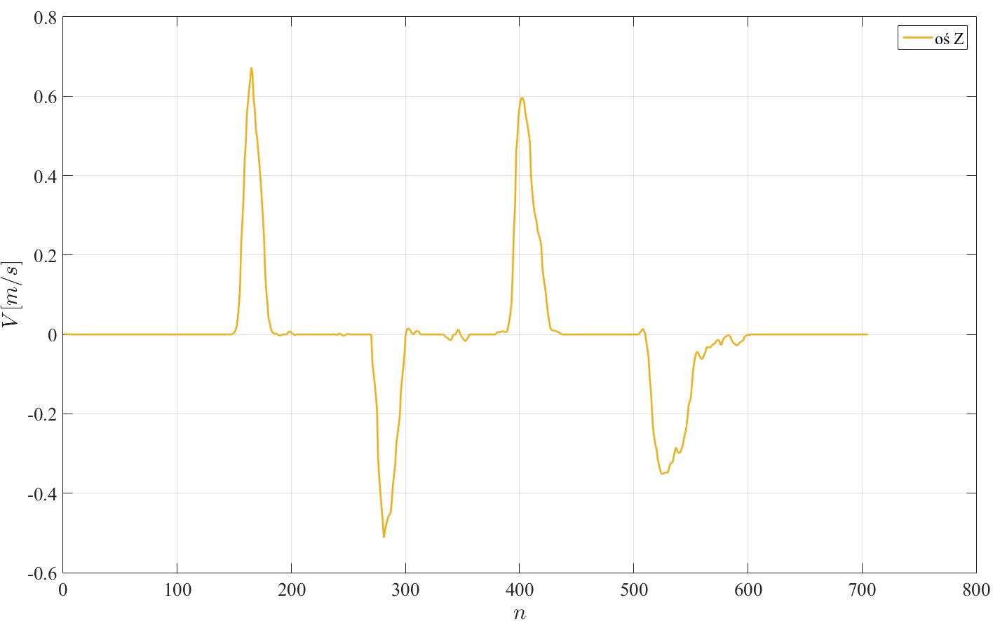

<a name="odisplacements"></a>
### Obtaining displacements of device
After integrating the velocity, we can obtain displacement as a function of time. Example plot is shown bellow.

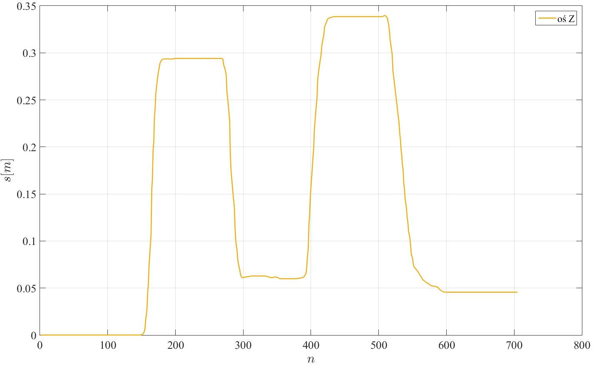

<a name="block"></a>
### Block diagram
Below is a complete block diagram of the algorithm for obtaining speed and displacements of device.

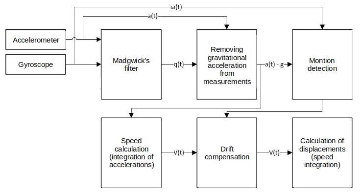

<a name="androidp"></a>
## Android application
For the needs of the project, a application for Android phones was written.

Functional requirements:
* processing of data collected from the sensors so as to obtain the value of displacement and speed of the device
* saving a series of measurement data under a user-specified name
* visualization of saved information in the application
* searching for Bluetooth devices nearby
* displaying paired Bluetooth modules
* establishing a Bluetooth connection through the phone with Arduino

Non-functional requirements:
* sending information from Arduino to phone through Bluetooth module
* collecting data in the local SQLite database
* adjusting the arrangement of controls to the size of the screen on which it is running application
* application designed for the Android system platform with a minimum version of SDK 15

Some screenshots:
<p float="left" style="text-align: center;">
  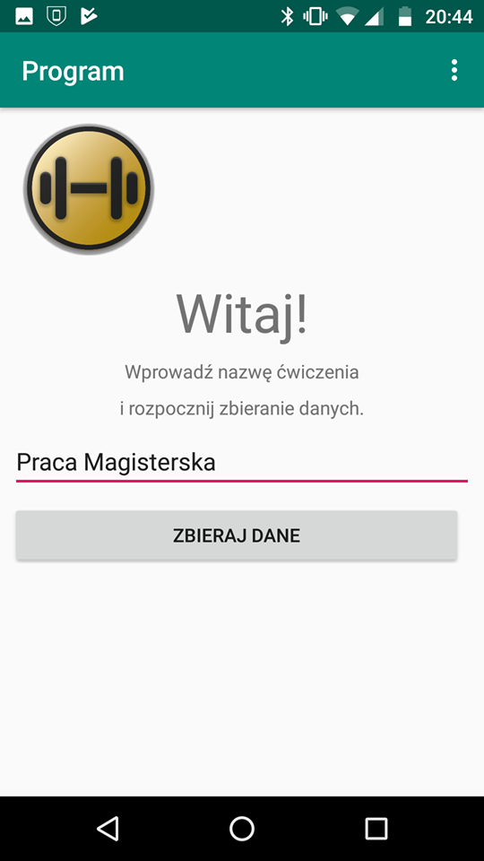
  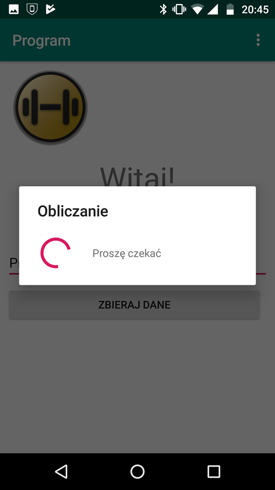
</p>
<p float="left" style="text-align: center;">
  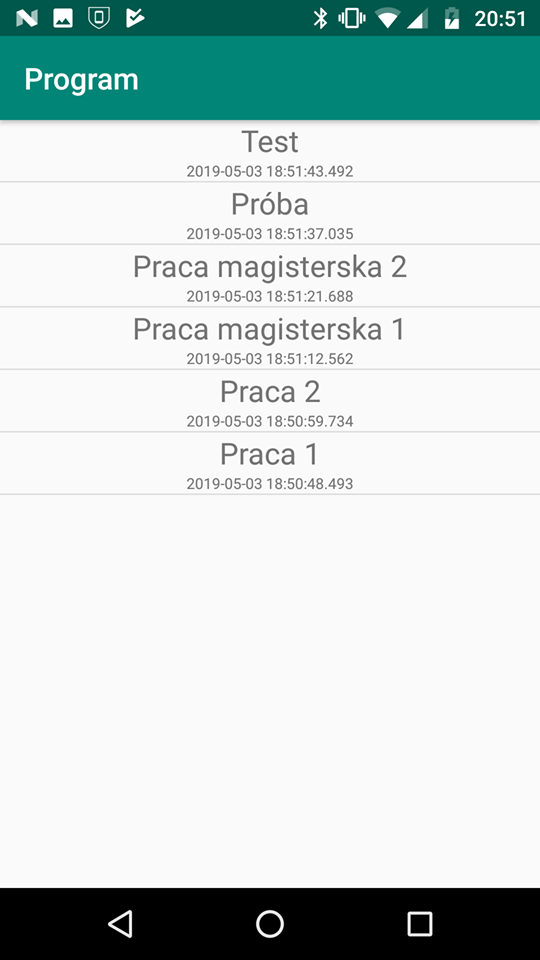
  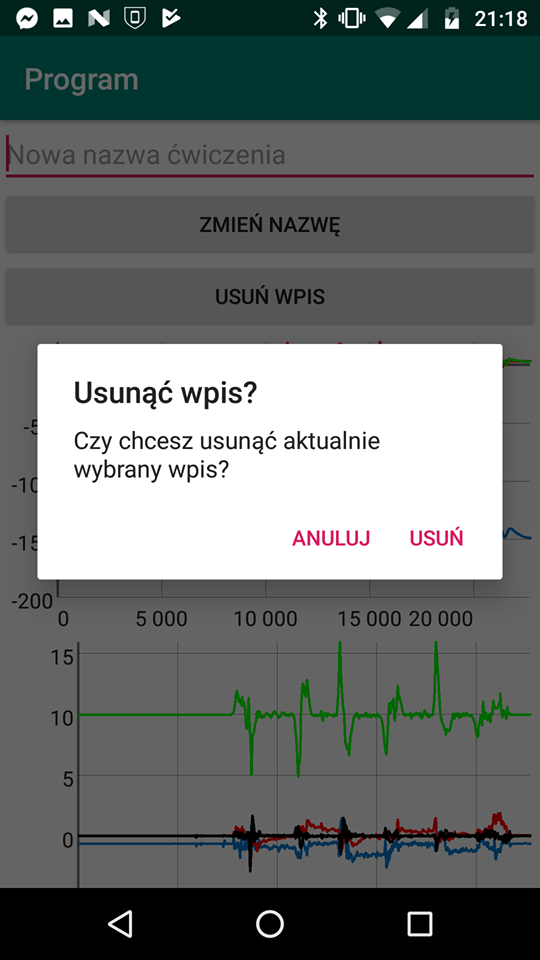
  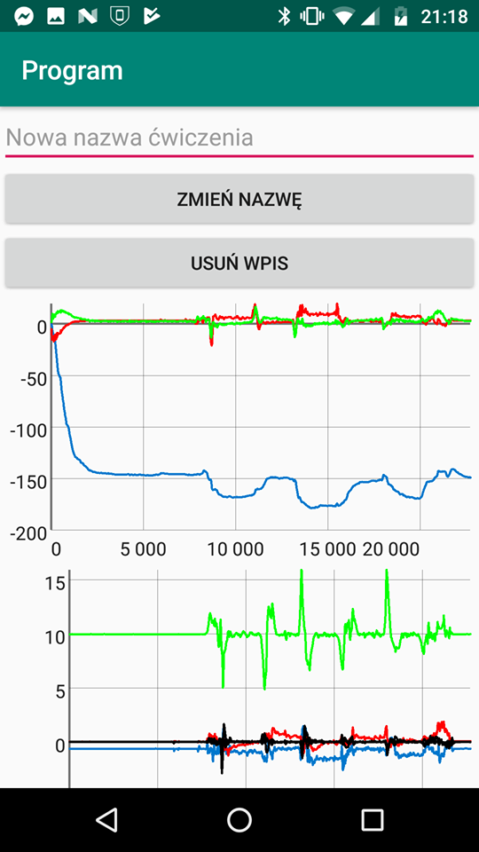
</p>

<a name="case"></a>
## Device case
I also provide a project of case designed for the Olympic barbell. You can mount a 50mm x 70mm breadboard and a 6F22 battery in it.
<p float="left" style="text-align: center;">
  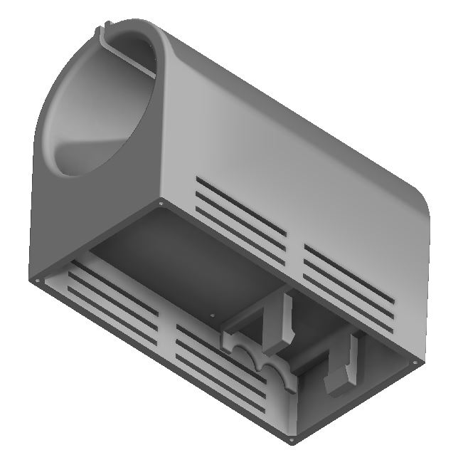
  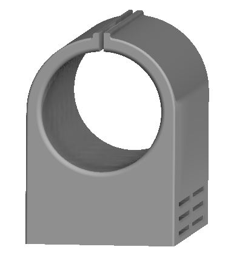
</p>

After printing:
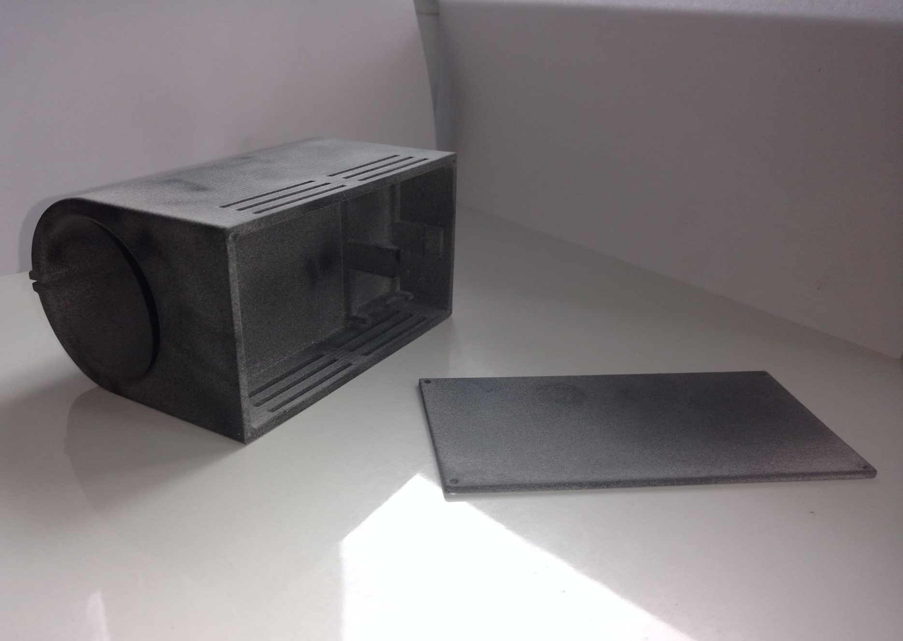

<a name="testing"></a>
## Testing
The device was tested by attaching it to a robot arm that moved a given distance at a certain speed.
<p float="left" style="text-align: center;">
  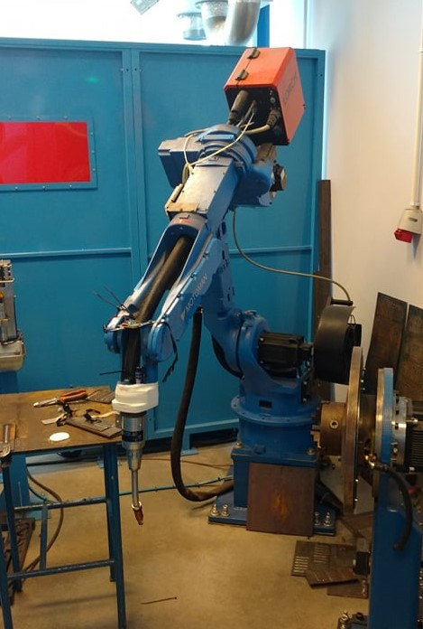
</p>

The average error was quite large (~12%) - probably could be smaller if more expensive sensors had been used. I paid for that one ~2$.

<a name="contact"></a>
## Contact
Created by [@Wojtek120](https://github.com/wojtek120) - feel free to contact me!

E-mail: Wojtek120PL@gmail.com
